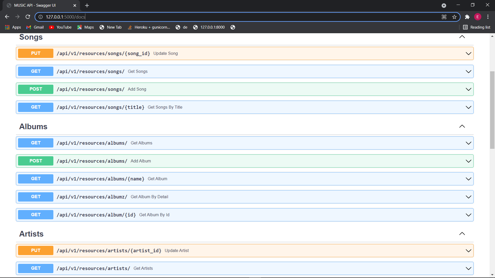

# MUSIC API

A nonsensical ASYNC music api using FastApi, Sqlalchemy and Ormar.



### HOW TO RUN
- cd into cloned package
- rename .env.example to .env
- terminal: ```python run.py```
- Browser: https://127.0.0.1:5000
- play around with the endpoints - break it, fix it, improve it!


##### This repository is for educational purposes only - on getting started with FastAPI+Ormar and doing async db transactions.

###### Song Model - cover image and audio file uses LargeBinary
```python

#####api/db.py
class Song(ormar.Model):
    class Meta:
        tablename = "songs"
        metadata = metadata
        database = database
        
        

    id: int = ormar.Integer(primary_key=True)
    title: str = ormar.String(max_length=100, nullable=False, index=True)
    artist: Optional[Artist] = ormar.ForeignKey(Artist, blank=False, null=False)
    cover_image: bytes = ormar.LargeBinary(max_length=1000)
    audio_file: bytes =  ormar.LargeBinary(max_length=1000, nullable=False)
    uploaded_at: datetime = ormar.DateTime(timezone=True, server_default=sql.func.now())

```

###### Creating(POST) an Album:
```python

#####api/crud.py
async def add_album(payload: schema.AlbumCreate):
    album = Album.objects.create(**payload.dict())
    return await album
    
#####api/views/album_view.py
@album_view.post("/albums/")
async def add_album(
    payload: Album
):
    return await crud.add_album(payload) 
```


A typical response from the ```Get Albums``` endpoint:
[data not accurate, yes!]


```json
[
  {
    "id": 4,
    "name": "The Ultimate Best of QueenII",
    "cover_image": "bytes",
    "production_year": 2021,
    "uploaded_at": "2021-07-16T13:27:18",
    "artist": {
      "id": 1
    },
    "tracks": {
      "id": 2
    }
  },
  {
    "id": 3,
    "name": "The Ultimate Best of QueenII",
    "cover_image": "bytes",
    "production_year": 2021,
    "uploaded_at": "2021-07-16T13:27:18",
    "artist": {
      "id": 1
    },
    "tracks": {
      "id": 1
    }
  }
]
```

